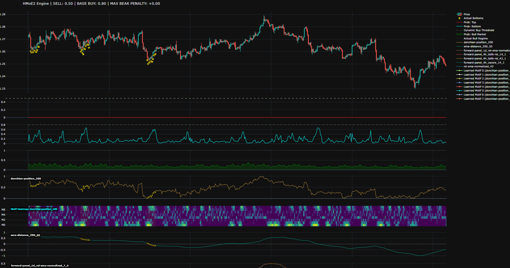

# HMoE2: Hierarchical Mixture of Experts

## Introduction
HMoE2 is a PyTorch-based quantitative trading and time-series forecasting engine. It implements a fully modular Hierarchical Mixture of Experts (HMoE) architecture, allowing you to route complex data streams through dynamically selected, heterogeneous neural networks.

## What It Is
Unlike traditional ensembles that blend models statically, HMoE2 uses learned routing gates to conditionally activate specialized neural backends based on the current market regime. 

**Key Features:**
* **Hierarchical Topology:** Nest routers within routers to create multi-level decision trees using simple YAML configurations.
* **Heterogeneous Backends:** Hot-swap "expert brains" depending on the required memory structure. Supported engines include:
  * `LINEAR` (Zero-memory momentum/scalping)
  * `RNN` / `GRU` / `LSTM` (Short to long-term structural sequential memory)
  * `TCN` (Temporal Convolutional Networks for swing/wave analysis)
  * `TRANSFORMER` (Causal attention for distant historical fractals)
  * `GATED_RESIDUAL` (Dynamic noise suppression for volatile data)
* **Sparse Gating (Top-K):** Forces hyper-specialization and compute efficiency by zeroing out unselected experts and utilizing load-balancing penalties.
* **Strict Data Isolation:** Custom Data Transfer Objects (`HmoeTensor`, `HmoeInput`, `HmoeOutput`) enforce shape safety, index tracking, and feature subsetting to prevent dimension mismatch crashes.
* **Continuous Focal Loss:** A custom loss engine optimized for continuous Gaussian heatmap targets (e.g., predicting exact market capitulation points).

## Quick Setup

Clone the repository and set up your environment:

```bash
# Clone the repository
git clone [https://github.com/jpueberbach4/hmoe2.git](https://github.com/jpueberbach4/hmoe2.git)

# Navigate into the project directory
cd hmoe2

# Create a virtual environment (recommended)
python -m venv venv
source venv/bin/activate  # On Windows use: venv\Scripts\activate

# Install required dependencies
pip install torch pyyaml requests
```

(Note: For GPU acceleration, ensure you install a CUDA-compatible version of PyTorch).

See examples directory.

## Future

The Mixture of Experts (MoE) architecture will soon be extended to support Rough Path and Matrix Profile (motif) experts. This enhancement allows individual experts to independently isolate and detect geometric structures within the feature space. When aggregated by the routing mechanism, these localized insights will improve the model's overall predictive confidence. For example, deploying both a Temporal Convolutional Network (TCN) and a Matrix Profile (MP) over an RSI feature enables the system to simultaneously extract momentum, velocity, levels, and underlying geometric shapes associated with the target markings



The example above features a heatmap illustrating the frequency of specific geometric structures within the feature space, with the top eight most prominent structures displayed at the bottom of the screen. Ultimately, we intend to leverage matrix profiles and rough paths to detect classic structural patterns on price charts—such as double bottoms, head-and-shoulders (SHS), and inverse head-and-shoulders (ISHS)—as well as to identify divergences across technical indicators.

## License

This project is licensed under the MIT License.
