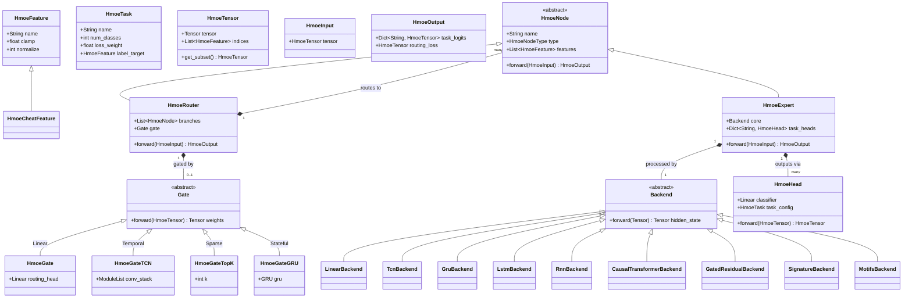

## Mermaid diagram

You need to install the mermaid plugin to see the diagram (vscode extension)

```mermaid
classDiagram
    %% Core Schema & Data Structures
    class HmoeFeature {
        +String name
        +float clamp
        +int normalize
    }
    class HmoeCheatFeature
    HmoeFeature <|-- HmoeCheatFeature

    class HmoeTask {
        +String name
        +int num_classes
        +float loss_weight
        +HmoeFeature label_target
    }

    class HmoeTensor {
        +Tensor tensor
        +List~HmoeFeature~ indices
        +get_subset() HmoeTensor
    }
    
    class HmoeInput {
        +HmoeTensor tensor
    }
    
    class HmoeOutput {
        +Dict~String, HmoeTensor~ task_logits
        +HmoeTensor routing_loss
    }

    %% Core Node Hierarchy
    class HmoeNode {
        <<abstract>>
        +String name
        +HmoeNodeType type
        +List~HmoeFeature~ features
        +forward(HmoeInput) HmoeOutput
    }

    class HmoeRouter {
        +List~HmoeNode~ branches
        +Gate gate
        +forward(HmoeInput) HmoeOutput
    }

    class HmoeExpert {
        +Backend core
        +Dict~String, HmoeHead~ task_heads
        +forward(HmoeInput) HmoeOutput
    }

    HmoeNode <|-- HmoeRouter
    HmoeNode <|-- HmoeExpert
    
    %% Composition Relationships
    HmoeRouter "1" *-- "many" HmoeNode : routes to
    HmoeRouter "1" *-- "0..1" Gate : gated by
    HmoeExpert "1" *-- "1" Backend : processed by
    HmoeExpert "1" *-- "many" HmoeHead : outputs via

    %% Task Heads
    class HmoeHead {
        +Linear classifier
        +HmoeTask task_config
        +forward(HmoeTensor) HmoeTensor
    }

    %% Routing Gates
    class Gate {
        <<abstract>>
        +forward(HmoeTensor) Tensor weights
    }
    class HmoeGate {
        +Linear routing_head
    }
    class HmoeGateTCN {
        +ModuleList conv_stack
    }
    class HmoeGateTopK {
        +int k
    }
    class HmoeGateGRU {
        +GRU gru
    }
    Gate <|-- HmoeGate : Linear
    Gate <|-- HmoeGateTCN : Temporal
    Gate <|-- HmoeGateTopK : Sparse
    Gate <|-- HmoeGateGRU : Stateful

    %% Neural Backends
    class Backend {
        <<abstract>>
        +forward(Tensor) Tensor hidden_state
    }
    class LinearBackend
    class TcnBackend
    class GruBackend
    class LstmBackend
    class RnnBackend
    class CausalTransformerBackend
    class GatedResidualBackend
    class SignatureBackend
    class MotifsBackend

    Backend <|-- LinearBackend
    Backend <|-- TcnBackend
    Backend <|-- GruBackend
    Backend <|-- LstmBackend
    Backend <|-- RnnBackend
    Backend <|-- CausalTransformerBackend
    Backend <|-- GatedResidualBackend
    Backend <|-- SignatureBackend
    Backend <|-- MotifsBackend
```