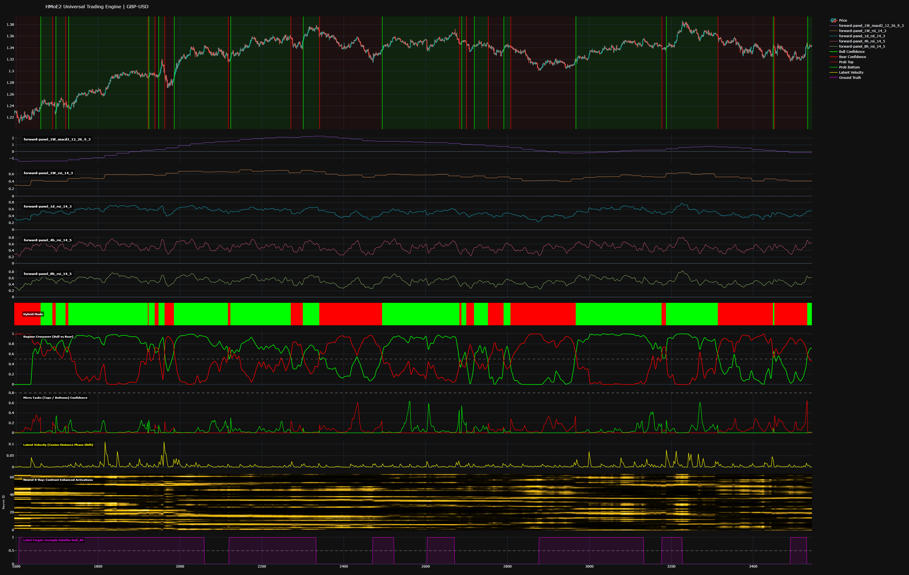

## What is this about

I have been actively trading for several years, experiencing alternating periods of strong performance and significant setbacks. Through this journey, it became clear that emotional decision-making was a primary weakness in my trading process. To address this, I have spent the past three months focusing on fully automating my trading workflow.

My initial effort centered on building a local data infrastructure capable of harvesting and resampling market data. The goal was to maintain complete control over the data pipeline, including the ability to define custom timeframes and operate without external rate limits. A key challenge in this phase was ensuring accurate support for custom session configurations and achieving full consistency with candle data from the Dukascopy MetaTrader 4 platform.

With unrestricted access to high-quality data, I aimed to create an environment where I could experiment extensively to identify effective automated trading strategies. Early in this process, I became convinced that the solution would involve neural networks. The challenge then shifted to determining the appropriate architectures and selecting the most relevant indicators.

The core objective has remained consistent: automatically detect the primary market trend, and within that context, identify optimal entry points—bottoms in uptrends and tops in downtrends. While this concept appears straightforward, meeting my performance standards proved significantly more complex. These standards include:

Approximately 90% accuracy in trend detection
Minimal lag during trend transitions (ideally fewer than 6 candles, or ~24 hours)
Reliable detection of sideways or “choppy” market conditions

Some may be familiar with the bp.markets.ingest project—an open-source initiative I developed to handle data ingestion, resampling, and feature generation (effectively an indicator factory), along with an API layer. Due to extensive experimentation and iterative changes, the project became increasingly difficult to maintain. I therefore chose to temporarily take it offline, with plans to either refactor it into a general-purpose library or relaunch it once it meets a higher standard of robustness and clarity.

In parallel, I explored multiple machine learning approaches, with a strong inclination toward ensemble methods composed of specialized neural networks. The idea was to develop distinct models, each excelling in a specific domain—trend detection, top identification, bottom identification, and potentially sentiment analysis.

My initial implementation, Pulsar, was a neuroevolution-based system designed to detect market bottoms. While it achieved a high F1 score, the resulting signals were too subtle and highly sensitive to changing market regimes. To address this, I developed RPulsar, a recurrent neural network variant. This improved performance further but introduced a new issue: the model attempted to learn both tops and bottoms simultaneously, leading to catastrophic interference, where learning the patterns for a top actively degraded the network's ability to remember the patterns for a bottom. 

Additionally, different indicators tend to be more effective for either tops or bottoms, yet the model was constrained to a single shared feature set. Although functional, it did not meet my quality requirements.

Given the financial implications of this work, I continued to deepen my understanding of neural network architectures and encountered the concept of Mixture of Experts (MoE). Commonly used in large-scale systems such as large language models, MoE architectures distribute learning across multiple specialized subnetworks. This aligned closely with my goal of creating expert models for distinct trading tasks.

I began experimenting with Microsoft Tutel, an MoE framework that provided promising initial results. However, it lacked the level of customization I required—particularly at the router level, which governs how inputs are distributed among experts. Additionally, its black-box nature limited transparency and control, both of which are critical for this type of system.

After gaining valuable insights from Tutel, I decided to develop a custom Mixture of Experts architecture from scratch. Unlike traditional MoE implementations focused on computational scaling across GPUs, my design emphasizes feature-space partitioning. Each expert is trained exclusively on a specific subset of features, allowing it to specialize without interference from unrelated signals.

The result is a hierarchical Mixture of Experts system in which both the router and the experts can utilize different neural network architectures, each tailored to its role. By isolating feature domains, this approach effectively eliminates catastrophic interference and enables more precise specialization.

One current limitation of this design is that experts do not share knowledge or learn from one another. This is a known trade-off, and I plan to explore solutions to enable controlled knowledge sharing in future iterations, should it prove beneficial.

## So what is the current status

The current status is that I have a functioning model for GBP/USD, achieving an average win rate of approximately 60% when entering positions on trend reversals with tight stop-losses. This figure is based on multiple backtesting periods and should be considered a consistent average rather than an isolated result.

At this stage, I am continuing to test, refine, and optimize both the underlying models and the supporting codebase.

Trend detection performance has reached a reasonably stable and satisfactory level. My current focus has shifted toward identifying intermediate market structures—specifically, detecting intermediate tops within downtrends and intermediate bottoms within uptrends.

Intermediate top detection is performing particularly well. However, bottom detection, which was previously the easier problem, is now producing overly smooth, Gaussian-like distributions. These signals lack precision and require further sharpening to improve timing and reliability.

## What is the general advice

### Model Overview

For trend direction, I use two weekly indicators: RSI and MACD. Both are lightly smoothed using a factor of 3. The RSI is normalized by dividing by 100, while the MACD line is scaled by a factor of 1000 (for GBP/USD). During training, I apply a positive class weighting (pos_weight) between 3 and 6 to address class imbalance.

The model is built on the Signatory backend with a window size of 200. At this stage, the router configuration is a simple pass-through.

### Regime Detection

The regime detector performs exceptionally well at identifying the start of uptrends, provided that the labels are accurate. However, it tends to lag when marking the end of uptrends.

This issue can be resolved by introducing a bearish head alongside the bullish one. By plotting both confidence outputs in a single panel, regime transitions become clear:

- Bullish crossover → exit short, enter long
- Bearish crossover → exit long, enter short

To reduce noise and avoid false switches during pullbacks, apply light smoothing to both confidence lines.

### Intermediate Tops & Bottoms

To detect intermediate turning points, I use multiple RSI indicators across different timeframes:

- 4-hour RSI (period 14, smoothed with factor 5)
- 8-hour RSI (period 14, smoothed with factor 5)
- 12-hour RSI (period 14, smoothed with factor 5)

All RSI values are normalized in the same way as the weekly RSI.

### Critical Requirement: Label Quality

Accurate regime labeling is absolutely essential. The labels must be flawless—this is the single most important factor for performance.

I created these labels manually. While tedious, this process only needs to be done once per asset and has a major impact on model quality.

### Example: Strategy Rules

- Training period: 2005–2020
- Out-of-sample: 2020–present
- Single model trained on GBP/USD
- Rough path only backends
- Seperate heads for bull and bear regime
- Seperate features for bull and bear regime (both binary on/off)

Execution logic:

- Bullish crossover → close short, enter long
- Bearish crossover → close long, enter short

Risk management:

- Initial stop-loss: 1%
- Move stop to breakeven at +1%
- Trailing stop: 1.5%
- **Slippage and swap costs not yet included**

### Results (Walk-Forward Backtest)

```bash
GBP-USD: 
2026-04-10 12:06:59 | INFO    | Macro_Visualizer | WALK-FORWARD BACKTEST RESULTS (1% Risk | 1% Target to BE | 1.5% Trail)
2026-04-10 12:06:59 | INFO    | Macro_Visualizer | ============================================================
2026-04-10 12:06:59 | INFO    | Macro_Visualizer | Total Trades : 147
2026-04-10 12:06:59 | INFO    | Macro_Visualizer | Win Rate     : 63.95%
2026-04-10 12:06:59 | INFO    | Macro_Visualizer | Net PnL (R)  : 89.68 R
2026-04-10 12:06:59 | INFO    | Macro_Visualizer | Longs        : 74
2026-04-10 12:06:59 | INFO    | Macro_Visualizer | Shorts       : 73
2026-04-10 12:06:59 | INFO    | Macro_Visualizer | ============================================================

EUR-USD:
2026-04-10 12:15:17 | INFO    | Macro_Visualizer | WALK-FORWARD BACKTEST RESULTS (1% Risk | 1% Target to BE | 1.5% Trail)
2026-04-10 12:15:17 | INFO    | Macro_Visualizer | ============================================================
2026-04-10 12:15:17 | INFO    | Macro_Visualizer | Total Trades : 139
2026-04-10 12:15:17 | INFO    | Macro_Visualizer | Win Rate     : 66.91%
2026-04-10 12:15:17 | INFO    | Macro_Visualizer | Net PnL (R)  : 78.12 R
2026-04-10 12:15:17 | INFO    | Macro_Visualizer | Longs        : 70
2026-04-10 12:15:17 | INFO    | Macro_Visualizer | Shorts       : 69
2026-04-10 12:15:17 | INFO    | Macro_Visualizer | ============================================================

NZD-USD:
2026-04-10 12:16:21 | INFO    | Macro_Visualizer | WALK-FORWARD BACKTEST RESULTS (1% Risk | 1% Target to BE | 1.5% Trail)
2026-04-10 12:16:21 | INFO    | Macro_Visualizer | ============================================================
2026-04-10 12:16:21 | INFO    | Macro_Visualizer | Total Trades : 151
2026-04-10 12:16:21 | INFO    | Macro_Visualizer | Win Rate     : 52.32%
2026-04-10 12:16:21 | INFO    | Macro_Visualizer | Net PnL (R)  : 73.62 R
2026-04-10 12:16:21 | INFO    | Macro_Visualizer | Longs        : 76
2026-04-10 12:16:21 | INFO    | Macro_Visualizer | Shorts       : 75
2026-04-10 12:16:21 | INFO    | Macro_Visualizer | ============================================================

...
```

### Conclusion

When properly labeled, the model generalizes well across multiple currency pairs and produces consistent profitability—even without optimization.

The main remaining issue is signal flickering, which increases trading costs and should be reduced in future iterations.

This is an honest initial assessment of the technology for trading applications. I am now transitioning to a new backend architecture based on a different class of neural networks—specifically Spiking Neural Networks (SNNs)—to evaluate whether they can reduce signal flickering and further improve overall performance.

Flickering issue (I will solve this):



The accidental reversal detector which works flawlessly on USD-JPY (very high WR) is being further explored, seeing if i can make the solution transition to different assets (it should be possible). General advice is to "play" with intentional scaling errors. You might end up with a pleasant surprise.

## Interesting

I encountered an interesting unintended result yesterday. By excessively scaling a particular feature, I effectively “distorted” the input representation of USD/JPY in a way that highlighted market turning points with remarkable precision.

This distortion acted almost like an X-ray of the price action at the exact moments where tops or bottoms occurred, producing signals that were significantly more precise than those generated by the dedicated detect_top and detect_bottom experts.

## Future

Parts of the codebase still rely on torch.tensor and need to be migrated to HMoeTensor. The HMoeTensor abstraction simplifies the mapping between features and tensor indices, improving both clarity and maintainability within the system.

The RSI-based solution will be published once I am sufficiently confident to deploy it in live trading. I intend to make it publicly available, as it is not easily arbitraged away. That said, the most recent iterations and refinements will remain private.

bp.markets.ingest will get relaunched.

I am pushing this a bit further. I want to see how this solution performs with a mixture of SNN (Spiking neural net) and RP. Performance is already good, WR-wise, but i just want to see what happens when i combine these two.

## Summarized

This custom Hierarchical Mixture of Experts (HMoE) architecture differentiates itself from general-purpose frameworks like Microsoft Tutel by strictly partitioning the feature space, meaning each expert is trained exclusively on a dedicated subset of indicators rather than the entire shared dataset. By isolating these feature domains, the architecture effectively eliminates catastrophic interference, allowing specialized experts to learn specific market conditions—such as a macro trend or a micro inflection point—without having their weights corrupted by conflicting signals from unrelated tasks. The result is a highly auditable, multi-task engine where distinct neural networks act as independent specialists, ultimately coordinated by a master router to execute complex, multi-layered execution logic.


